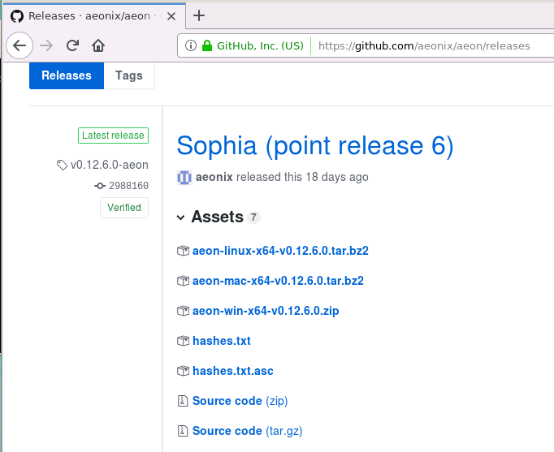

<html>

<body>

<h1>Setup AEON Command Line Wallet on Ubuntu</h1>

This How-To will walk through the process of setting up and
running the AEON local daemon and cli-wallet on Ubuntu 16.04.  The process
should work similarly on other flavors of Linux.

<h1>Requirements</h1>

- Ubuntu 16.04

- 2 GB RAM  (AEON will use &lt; 0.5GB RAM when running)

- 20 GB available hard drive space
(as of Oct 14, 2018, the AEON blockchain files use about 7.0 GB of disk space)

- The latest version of AEON

First, we need to download AEON to our Ubuntu machine. 
Navigate in the browser to:

<a
href="https://github.com/aeonix/aeon/releases">https://github.com/aeonix/aeon/releases</a>

&nbsp;

<b>NOTE:</b>  Make sure you get the 0.12.6.0 release or
later, as it has some important security and stability fixes.  The latest
release should always be listed first on the page.

<h1>Use the Provided Linux 64-bit Binaries</h1>

This option is easiest, if the binaries will run on your
version of Linux.  Note that you must be running a 64-bit Linux operating
system.  These should work fine on recent versions of Ubuntu.

(If you find that the provided binaries will not run on your
Linux system, you have the option to download and build the binaries on your own
system. This will be covered in a later guide.)

To download the provided binaries, click on the
“aeon-linux-x64-v0.12.6.0.tar.bz2” link, and save the file.  This will likely
save the file in your Downloads directory, unless you specify another location.

&nbsp;

<b>NOTE:</b>  To enter the commands in this tutorial, you
will need to be logged into your Linux machine with a Terminal program, or from
the Desktop you can open the Terminal Emulator that is provided with your
version of Ubuntu.

<b>NOTE:  </b>In the pictures below, each command begins
after the command prompt.  On my system, the command prompt always starts with “<b>minnow@faramir:</b>”
followed by the current directory path, and ends with the dollar sign character
(<b>$</b>).  So the first command in the below picture is “mkdir App”.  As you
follow along, type the commands after your command prompt in your terminal
window, and press the Enter key after typing each command.

&nbsp;

First, we should set up a directory for our aeon apps.  It
will hold any versions of Aeon we install, and any mining software we may
install later.  I will create a new directory within my home directory, called
“App”.  If you choose a different name, be sure to use your directory name in
place of “App” in any below commands.

&nbsp;

Next I will unpack the file I downloaded, into the App
directory, using the “tar” command. In the picture below, the command is on the
first line.  This assumes you downloaded AEON to your “Downloads” directory. 
If you downloaded it to a different location, you will need to replace
“./Downloads/” with the correct directory of the file on your machine.

<b>NOTE:</b>  The period-followed-by-slash (./) in the commands signifies "the current
directory".  I am running this command from my home directory, and the "Downloads" and "App"
directories are both located there.  That is why you see
"./Downloads/..." and "./App".

From the 8 lines of output above, we can see that a new
directory was created inside our App directory, called “<b>aeon-v-0.12.6.0</b>”. 
All of the provided binaries now exist within that sub-directory.

To validate that everything looks right, you can use the
“cd” command to change to the new directory, and the “ls” command to list all
the files in that directory.  This is shown in the below picture:

Notice the 7 green files listed below the “ls” command. (You may not see them in green.)
Those are the AEON binaries.  

In this tutorial we will be using the <b>aeond </b>and the <b>aeon-wallet-cli</b>
binaries.  You can run them from within this directory.

&nbsp;

<h1>Running the Local Node for the First Time</h1>

The <b>aeond</b> binary is the Local AEON Node application. 
(It is also known as the “aeond daemon”.)  

When running for the first time, your node will download the
entire AEON blockchain to your computer.  To speed up this process, we run the
node with 2 parameters as follows:

                ./aeond
--block-sync-size 1000 --max-concurrency 15

Make sure you enter the command with the correct dashes and
spaces!

You should see the AEON node output in your terminal window
as shown below:

Note that you want to see the correct version # in the first
output line.  In this case “(v0.12.6.0-master-release)” is correct.

You should see further down, a message that begins “The
daemon will start synchronizing with the network.”  And finally, you should see
the message “SYNCHRONIZATION started” before a pause.

The synchronization process can take 2 – 4 hours (or more)
to complete, depending on your computer.  You will see some progress messages
in your terminal window along the way.  So now you can go do something else productive while
you wait!

When your node has finished sync’ing the blockchain, you
will see a final message as shown below:

&nbsp;

Congratulations!! Your local node is now running and fully synchronized with
the AEON blockchain!

As you can see in the picture above, you can enter commands
to your node in this window.  The <b>help</b> command will show a list of all
available commands.

The <b>version</b> command will tell you what version of the
daemon you are running.  The <b>status</b> command will show a line of useful
information, including:  the current block height, the total hash rate on the
network, and how long the daemon has been running.  The <b>save</b> command
will ensure the blockchain is saved, and the <b>exit</b> command will stop the
node and exit.  These commands and their output can be seen in the picture
below.

<b>&nbsp;</b>

<b>NOTE:  </b>After your node has sync’d for the first time with the
blockchain, you may subsequently start it from the command line without the extra 2
parameters, by simply entering:    ./aeond

&nbsp;

<h1>Running the CLI Wallet for the First Time</h1>

Your wallet will connect to the AEON network through your
node, so first make sure that your node is running in a command terminal. 
Then, open a 2nd terminal window so you can run your wallet.

In your newly opened terminal, change to the directory where
your AEON binaries are, and run the <b>aeon-wallet-cli</b> application as shown below:

(Note that your binaries may be in a different location than
the “App” directory in the examples.)

&nbsp;

First, you will need to enter a name for your wallet. I have
entered <b>FirstWallet</b> as the name in the example below, and am entering <b>Yes</b>
to confirm.

&nbsp;

Next you will be prompted to enter a password for your
wallet. You will need this password whenever you run the cli wallet to open
your wallet, so <i>do not forget your password</i>.  You should make this a
strong password, so that it cannot be guessed if someone gains access to your
wallet files.  You will be asked to type your password a 2nd time to
confirm.  

Finally, you will be asked to choose the language for your
wallet’s seed words, after which your wallet will be created as shown the
picture below:

The first thing you will see is the very long primary wallet address
(beginning with <b>Wmsrb2…</b> in the picture above), followed by the not-quite-as-long <b>view
key</b>.  People can send AEON coins to your primary wallet address, and they
will appear in your wallet. You can copy these into a document to save them if
you want, but you can always see them from within your wallet by using the <b>address</b>
command and the <b>viewkey</b> command.

After some brief instructions, you can see your wallet’s
25-word “seed” (mostly covered in the middle of the picture above).  You should
follow the advice in the “NOTE” on the screen.  These 25 words are the <b><i>only
way</i></b> to recover your wallet – and all of its funds – in the case that
this computer crashes and the wallet files are lost.  If someone steals this
seed from you, they can gain access to your wallet and all of its funds.  You
should write down the seed words <i>in order from left to right</i>, starting
with the 1st line, then the 2nd line, then the 3rd
line. Store them somewhere very safe; generally <i>not</i> on the same computer that 
might crash or get hacked.

Last you will see a summary of your wallet’s accounts and
balance.  There is only 1 primary account, and a balance of 0 for a new wallet.

Your wallet is now running connected to your node, and will
automatically refresh the balance should any coins be sent to it.  You can
enter commands after the prompt at the bottom of the screen.  Enter <b>help</b>
to see a list of available commands.  In the next section we will explore some
of the CLI wallet commands.

<h1>Useful CLI Wallet Commands</h1>

Some useful commands are:

the <b>balance</b> command, which shows your wallet’s balance

the <b>exit</b> command will properly save your wallet data and
exit the application

the <b>password</b> command, which allows you to change your
wallet’s password

the <b>refresh</b> command, which forces an immediate refresh if you are 
impatiently awaiting the arrival of a payment.

the <b>save</b> command, which saves your wallet data

the <b>status</b> command shows whether the wallet is synced to
the node

the <b>version </b>command shows the AEON release version number

the <b>viewkey</b> command shows the view keys for your wallet

&nbsp;

<h2>The “address” Command and Receiving Payments</h2>

The <b>address</b> command allows you to see any addresses
in your wallet (your primary address by default). Enter <b>address all</b> to
see all addresses within your wallet.  

You can also use the address command to create new
addresses within the same wallet.  Let’s say I want to create a new address for
the sole purpose of receiving payouts from mining AEON.  I could create a new
address and give it the label “Mining Payouts”.  Then if I want to create an
address to receive donations, I can create another address with the label “Donations”.

The picture below shows my command to create the Donations
address.  Note that it has the ID number 2.  The primary address is always ID #
0, and I first created the mining payouts address as ID # 1.

To receive a payment, simply provide one of your wallet
addresses to the person who wants to send you some AEON coins.  They will transfer
coins from their wallet to your address, and after a short time the coins will
appear in your wallet balance.

&nbsp;

<h2>Sending AEON: the “transfer” Command</h2>

To send AEON from your wallet to another wallet, you will
use the <b>transfer</b> command.  The basic usage is as follows:

   transfer [&lt;priority&gt;]
[&lt;ring_size&gt;] &lt;address&gt; &lt;amount&gt; [&lt;payment_id&gt;]

The result is that you will transfer the specified &lt;amount&gt;
of AEON coins to the specified wallet &lt;address&gt;.

The &lt;priority&gt; value is directly related to the
transaction fee that will be charged; higher priority transactions will be fulfilled more
quickly for a higher fee.  Valid values in order of priority are:  <b>unimportant</b>,
<b>normal</b>, <b>elevated</b>, and <b>priority</b>.  If omitted, the default transaction
fee is used.

&lt;ring_size&gt; is the number if <b>mixins</b> to use for
untraceability.  The default ring_size is 3, and a ring size of 1 is not
allowed.  A ring size of 0 is only allowed in 10% of transactions within each
block, and results in full visibility of the send/receive addresses on the blockchain. 
A ring_size larger than 3 <i>may</i> increase the transaction fee, but provides
a greater degree of privacy for the sender and receiver.

An optional &lt;payment_id&gt; may be used for accounting
purposes, so the sender and receiver will know what the payment was intended
for.

&nbsp;

</body>

</html>
