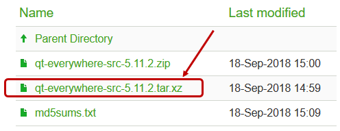
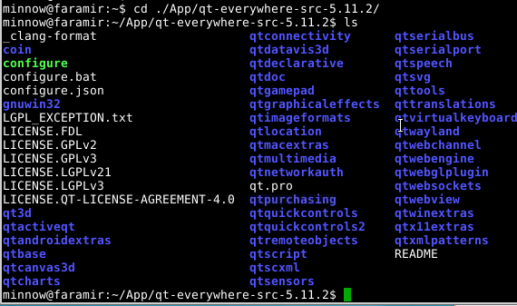
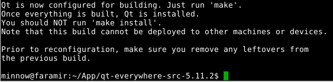
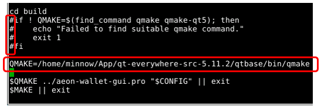
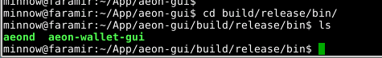

<h1>Build AEON GUI on Ubuntu</h1>

This How-To will show the steps to build the AEON GUI wallet on Ubuntu.

<h1>Requirements</h1>

*   Ubuntu 16.04 (or later)
*   RAM:  2 GB
*   Hard drive space: 20 GB free (+40 GB if you build Qt from source, +20 GB if you want to run the AEON node as well)
*   A 64-bit CPU

<h1>Install AEON Dependencies</h1>

Before we can build AEON GUI, we need to make sure we have all the necessary packages installed on our Ubuntu system. These packages are required to compile and link the source code, as well as to run the final application.

We can install all needed dependencies with a single long command:

          sudo apt install build-essential cmake libboost-all-dev miniupnpc libunbound-dev graphviz doxygen libunwind8-dev pkg-config libssl-dev libzmq3-dev git libsodium-dev

Note that you must have administrator privileges to run the above command, and you may be prompted to enter your password first.

The <b>apt</b> package manager will first tell you which packages are already installed, and which "NEW" packages will be installed. It will also tell you how much disk space will be used to install all the packages. Enter 'Y' to run the package installs, and you will see the progress output on the terminal window.

<h1>Install Qt</h1>

Qt is the name of a graphics package/builder that builds modern user interfaces, and it is used for the AEON GUI interface.  We need to install Qt version 5.7 or later on our Ubuntu system.

<h2>Using Ubuntu 17.10+</h2>

<b>IF YOU ARE USING UBUNTU 17.10 OR LATER</b> you can install Qt with the following command:

          sudo apt install qtbase5-dev qt5-default qtdeclarative5-dev qml-module-qtquick-controls qml-module-qtquick-controls2 qml-module-qtquick-dialogs qml-module-qtquick-xmllistmodel qml-module-qt-labs-settings qml-module-qt-labs-folderlistmodel qttools5-dev-tools

After Qt successfully installs, you can skip to the <b>Build AEON GUI</b> section below.

<h2>Using Ubuntu 16.04</h2>
<h3>NOTE: Downloading and building Qt from source uses 40GB of disk space.</h3>

<b>IF YOU ARE USING UBUNTU 16.04</b> you will need to build the latest version of Qt from the source code. Navigate in your browser to this page:

<a href="https://download.qt.io/archive/qt/5.11/5.11.2/single/">
https://download.qt.io/archive/qt/5.11/5.11.2/single/</a>

Click on the <b>qt-everywhere-src-5.11.2.tar.xz</b> link as shown in the picture above, and save the file. Note that this is a large file, and will take some time to download.

(NOTE: If you haven't done so already, you should create a directory for your AEON apps. I created a sub-directory within my home directory, called "App", by entering the command "mkdir App".  If you are using a different sub-directory, be sure to use your directory name in place of "App" in any of the commands in this tutorial.)

Unarchive the downloaded source code with the following command, from your home directory:

          tar -xJvf ./Downloads/qt-everywhere-src-5.11.2.tar.xz -C ./App

This will unpack many, many source files to a new <b>qt-everywhere-src</b> sub-directory within your ./App directory. Use the <b>cd</b> and <b>ls</b> commands to see the contents, shown in the picture below.

Before building Qt, there are additional dependencies needed. Make sure these are installed with the following commands:

          sudo apt install perl python '^libxcb.*-dev' libx11-xcb-dev libglu1-mesa-dev libxrender-dev libxi-dev flex bison gperf libicu-dev libxslt-dev ruby libasound2-dev libgstreamer0.10-dev libgstreamer-plugins-base0.10-dev

          sudo apt install libssl-dev libxcursor-dev libxcomposite-dev libxdamage-dev libxrandr-dev libdbus-1-dev libfontconfig1-dev libcap-dev libxtst-dev libpulse-dev libudev-dev libpci-dev libnss3-dev libxss-dev libegl1-mesa-dev libclang-3.9-dev

Now, make sure you are in the sub-directory where your Qt source files were unpacked, and enter the following command to prepare the Qt build files:

          ./configure -developer-build -opensource -nomake examples -nomake tests -confirm-license

The configure program will check your system for the required libraries and components, and create the build files for your system. If successful, you will see the below message. (NOTE: if instead you see an error, you may need to install another library package using the "sudo apt install ..." command again.)

Next, you build Qt by entering "make" in your terminal window, from within the Qt source files sub-directory. If the make completes without errors, you are ready to build AEON GUI.

(Note that it can take a few hours to build the Qt source. If you have a multi-core CPU, you can run "make -j 2" to run the build on 2 CPU cores.)

&nbsp; 

<h1>Build AEON GUI</h1>
<h3>NOTE: Downloading and building Qt from source uses 1 GB of disk space.</h3>

Now, you are ready to start the process of building the AEON GUI source code.

<h2>Get the Source Code</h2>

First, get the source code by cloning the GitHub repository. Enter the following command in your terminal. Note that this will create a new sub-directory within the directory that you run the command, called <b>aeon-gui</b>, and place all the source code there. I ran this command from within my <b>./App</b> directory.

          git clone https://github.com/aeonix/aeon-gui.git

Now, change directories to the <b>aeon-gui</b> sub-directory:

          cd ./aeon-gui

<h2>Fix the Broken Library</h2>

At the time of writing this guide, there is a missing library in the file:

          aeon-gui/aeon-wallet-gui.pro

To fix this issue, edit the above file in your favorite editor, go to line 116, and <b>if you don't see it already</b>, add the line that is highlighted below:

!ios:!android {  
LIBS += -L$$WALLET_ROOT/lib \  
&nbsp;&nbsp;&nbsp;&nbsp;&nbsp;&nbsp;&nbsp;&nbsp;-lwallet_merged \  
&nbsp;&nbsp;&nbsp;&nbsp;&nbsp;&nbsp;&nbsp;&nbsp;-llmdb \  
&nbsp;&nbsp;&nbsp;&nbsp;&nbsp;&nbsp;&nbsp;&nbsp;-lepee \  
&nbsp;&nbsp;&nbsp;&nbsp;&nbsp;&nbsp;&nbsp;&nbsp;-lunbound \  
&nbsp;&nbsp;&nbsp;&nbsp;&nbsp;&nbsp;&nbsp;&nbsp;-leasylogging \  
<b>&nbsp;&nbsp;&nbsp;&nbsp;&nbsp;&nbsp;&nbsp;&nbsp;-lsodium \</b> 
}

This will ensure that the <b>lsodium</b> library is properly included in the build.

<h2>If You Built Qt From Source</h2>

<b>ONLY IF YOU ARE USING UBUNTU 16.04 and/or built the Qt package from the source code:</b>

You must tell the AEON GUI builder where the Qt make program is. The location will be the the directory where you unpacked the Qt source code, in the subdirectory <b>qtbase/bin/</b>. We can tell the builder this location by editing the <b>build.sh</b> file in the <b>aeon-gui</b> directory.

In the picture above, you can see 4 lines that begin with the '#' character. You must add that character to those 4 lines, which will cause them to be skipped by the builder. Then you must add the new line which begins with "QMAKE=", with the correct directory path to your version of qmake. Save these changes, and now you are ready to run build.sh with the version of Qt that you built from source.

<h2>Launch The Build</h2>

Run the build with the following command, from within the <b>aeon-gui</b> sub-directory:

          ./build.sh

If the build finishes without errors, you can check for the expected binary files in the <b>./aeon-gui/build/release/bin/</b> sub-directory.  Use the <b>cd</b> command and <b>ls</b> commands as shown below.

If your build succeeded, you will see the 2 files shown in the picture, <b>aeond</b> and <b>aeon-wallet-gui</b>.

&nbsp; 

<h1>Run the AEON GUI Wallet</h1>

You can now run the AEON GUI from the <b>bin</b> directory.  Run AEON GUI with the following command:

          ./aeon-wallet-gui

Note that at the time of this writing there are several known <b>WARN</b> logs that will appear in the terminal window when you run the wallet. As long as they are WARN, the wallet will still run correctly. You should see the screen below.

Congratulations!! You have successfully built the AEON-GUI wallet!

Now check out the various How-To guides for using AEON GUI, which are linked from this site.

&nbsp; 

