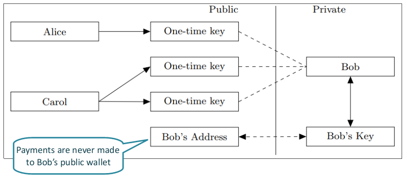
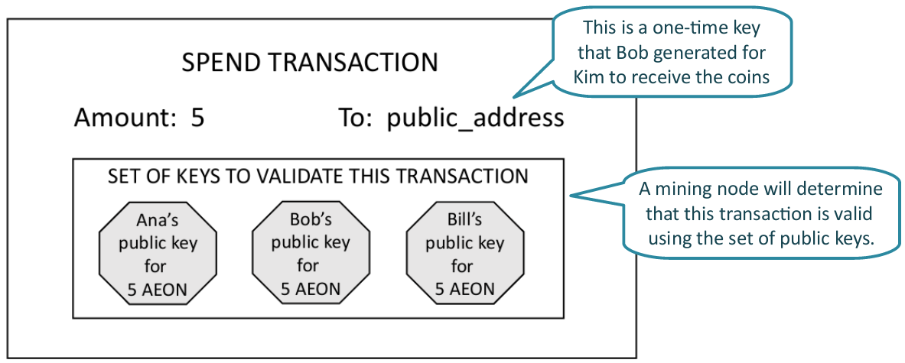
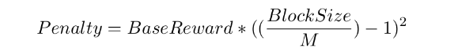
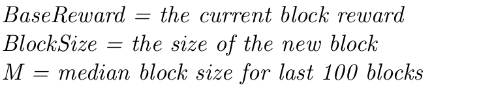
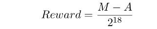
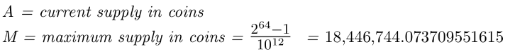
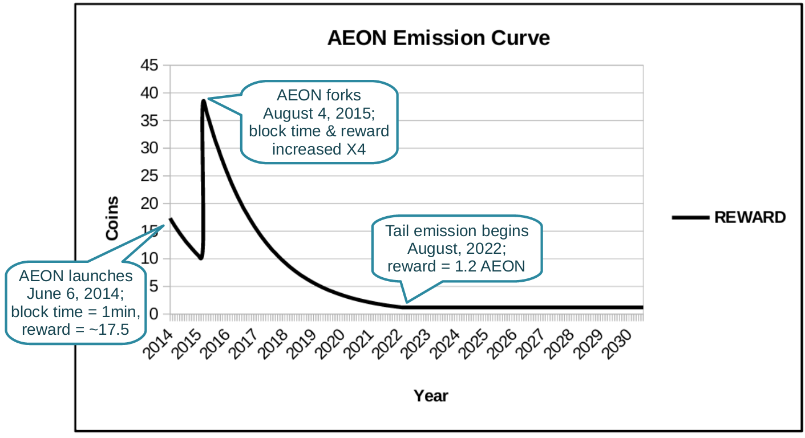
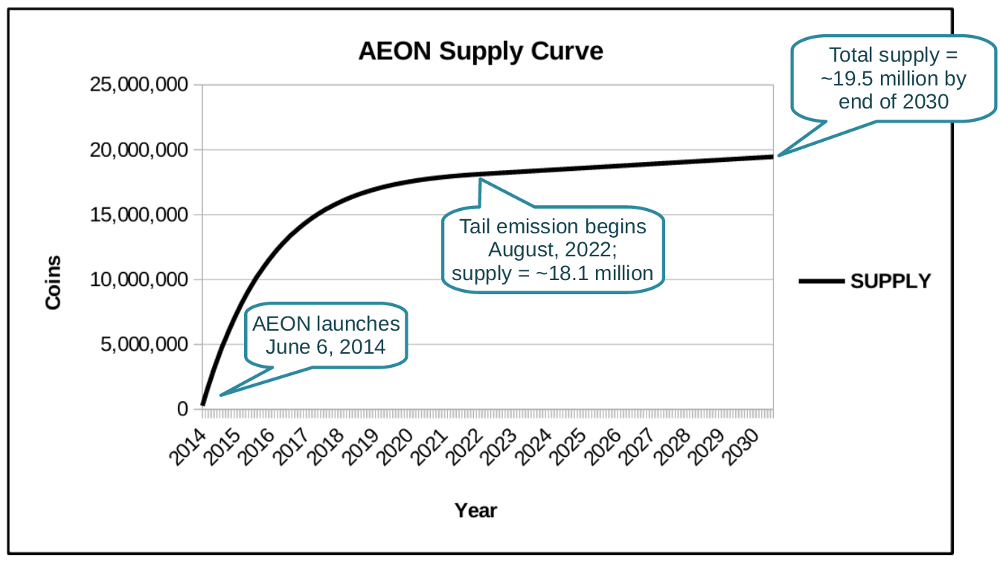

<h1>AEON Technical Implementation</h1>

<b>(Last updated February 19, 2019)</b>

The implementation of AEON is derived from two other open source projects:  <b>CryptoNote</b> and <b>Monero</b>.

The CryptoNote technology focuses on the ability to create crypto-currencies with untraceable transactions, CPU-friendly proof-of-work algorithm, and the ability of self-adjusting parameters such as block size and difficulty. Several crypto coins have been based on the CryptoNote technology.

Monero is one of the earliest crypto currencies to use the features of CryptoNote, and has grown to be the most popular with a market cap well within the top 20 crypto coins.  AEON was started from the Monero code base, and modified only in ways that meet the specific vision and goals of the AEON community.

<h2>Achieving Trustless Transactions</h2>

One of the goals for AEON transactions is to have the properties of <i>physical cash</i> payments, as opposed to electronic payments.

Consider the example of paying for a meal at a restaurant. With electronic payment (i.e. a credit card), there is a trusted 3rd party (i.e. Visa) which carries out the transaction for the payer and receiver. The trusted party must know both the payer's and receiver's identities and account information to settle the transaction. Additionally, the receiver may also receive the payer's name and partial account information.

In contrast, paying for a meal with cash is <i>trustless</i> (requires no trusted 3rd party to carry out the transaction). It is also <i>anonymous</i> in that it does not require the payer to give their name or any other personal information to the receiver.

To achieve trustless, decentralized transactions, AEON utilizes a proof of work “mining" process.  For a definition of PoW, the <a href="https://en.bitcoin.it/wiki/Proof_of_work">Bitcoin Wiki</a> offers this:

"A <b>proof of work</b> is a piece of data which is difficult (costly, time-consuming) to produce but easy for others to verify and which satisfies certain requirements. Producing a proof of work can be a random process with low probability so that a lot of trial and error is required <i>on average</i> before a valid proof of work is generated."

The goal of the proof of work process, is to provide decentralization of both the distribution of coins and the validation of transactions. The difficult trial-and-error nature of producing the PoW is an effective means of randomizing which miner will create and correctly validate the next block of transactions, and receive the reward of new coins. This randomization ensures that the processing of transactions is spread indiscriminately over the entire network.

A disadvantage of the PoW function for many cryptocurrencies (including Bitcoin) is that it relies solely on processor speed, which allows high-end GPU's and specialized mining hardware (ASICs) to have a great advantage in producing the correct proof of work. This condition leaves the majority of PC owners unable to participate in the mining process for coins, and creates an environment where relatively few miners control the network.  Thus, the goal of decentralization is somewhat defeated.

An improved PoW algorithm, eventually called CryptoNight, was proposed in 2012 by the CryptoNote project. According to the <a href="https://cryptonote.org/whitepaper.pdf">CryptoNote whitepaper</a>:

“Our primary goal is to close the gap between CPU (majority) and GPU/FPGA/ASIC (minority) miners. It is appropriate that some users can have a certain advantage over others, but their investments should grow at least linearly with the power. More generally, producing special-purpose devices has to be as less profitable as possible."

The CryptoNight algorithm accomplishes this goal in 2 primary ways.

*   It uses built-in CPU instructions, which are difficult to implement in specialized hardware.
*   It relies on access to unpredictable locations in a 2 MB “scratchpad" of CPU memory, rather than relying solely on CPU processing speed.

These factors effectively limit the advantages of GPU's over CPU's and make it too costly to produce specialized ASIC hardware for mining.

For its proof of work, AEON implements a variation of this algorithm, called  <b>CryptoNight-Lite</b>. As the name suggests, this is a lightweight version of the original algorithm, which utilizes a 1 MB scratchpad.  This results in half the iterations needed to compute a hash, and half the required L3 cache CPU memory.  Many lower end processors (on mobile devices) will have the required 1 MB of CPU cache, and multi-core CPU processors will see up to a 4X performance boost over the heavier CryptoNight algorithm.

<h2>Achieving Anonymous Transactions</h2>

The previous section explained how the PoW algorithm creates a decentralized trustless network of miners to process transactions.  To achieve anonymity, the payer's and receiver's identities and account (wallet) information must be kept hidden on the public blockchain.

<h3>One-Time-Use Keys</h3>

AEON uses the CryptoNote solution to receive payments at a one-time-use public key address, rather than the recipient's public wallet address.  The public key is generated by the sender, using both the recipient's public wallet address and some random data.  Once generated, funds are sent directly to this public key, which can be used only once.  The recipient can later spend any received coins, by using a one-time-use private key (called a <b>ring signature</b>) which corresponds to the one-time public key.

The following picture, from the CryptoNote whitepaper, shows that the one-time public keys are never linked to the receiver's public wallet address on the blockchain.  This effectively keeps the receiving wallet anonymous.

<h3>One-Time Ring Signatures</h3>

After funds are received via a one-time public key, the recipient is able to spend the funds at any time, using a one-time ring signature.  The goal of the ring signature is to keep the sending address anonymous on the blockchain.

In non-private implementations, the sender will “sign" their payment transaction with a private key that can be validated only by using the sender's corresponding public key.  Only the sender knows the private key, but the whole world can see that the sender's public key was used to validate the transaction.

The idea behind the ring signature is straightforward:  a sender produces a signature which can be validated by a <i>set</i> of public keys rather than a unique public key.  The identity of the one who produced the signature is indistinguishable from the owners of the additional public keys within the set.

Consider an example:  Bob wishes to send 5 AEON to Kim.  The picture below shows the ring signature concept for this transaction on the blockchain, using a default ring size of 3.

Note in the example, that the 2 “decoy" public signatures are actually past transaction outputs that are pulled from the AEON blockchain. Thus, all 3 inputs in the set are valid signed inputs for 5 AEON, but only Bob's is valid for <i>this</i> transaction.  It is impossible for someone looking at this transaction on the blockchain to determine which of the 3 inputs was the valid one.  Additionally, all 3 of the inputs will likely show up as decoys in multiple other transactions.

In the AEON blockchain, the total number of inputs, known as the <b>ring size</b>, is set to 3 by default. The sender may choose a different ring size for their transaction, and the selection of each decoy input is handled automatically by AEON. More than 3 inputs will result in a higher level of anonymity, but will require a higher transaction fee.

For non-sensitive transactions to be processed with a slightly lower fee, a ring size of 1 can be chosen.  To preserve overall blockchain anonymity the number of such transactions is limited to no more than 10% of the transactions in each block.  Additionally, a ring size of 2 is not allowed since it does not provide a high enough assurance against blockchain analysis.

<h3>Known Weaknesses</h3>

One possible attack against Anonymity is analysis based on the amounts sent in a transaction. If a bad actor knows, for example, that 0.9 coins have been sent at a certain time, then they may search for transactions containing 0.9 coins to attempt to identify a sender.  This is negated by the use of one-time keys and other factors, but the visibility of the amounts on the blockchain is a downside.

Furthermore, as seen in the illustration in the previous section, the ring signature approach requires the specific amount of each of the inputs to match.  For less common amounts, there will be fewer public keys available for decoys, reducing the level of anonymity.

The Monero development team has created a solution for these weaknesses, known as <b>Ring Confidential Transactions</b> (RingCT), which will obscure transaction amounts on the blockchain.  The AEON community plans to adopt this solution as soon as it can be incorporated by the development team.  There are more details on the new RingCT protocol in the Monero publication <a href="https://lab.getmonero.org/pubs/MRL-0005.pdf">Ring Confidential Transactions</a>.

<h2>Coin Minting Process</h2>

As mentioned in the section <i>Achieving Trustless Transactions</i>, new AEON coins are distributed over time, to mining applications (called <b>nodes</b>), as a reward for calculating the correct Proof Of Work. This section will focus on the details of the coin distribution process.

<h3>Block Creation</h3>

One of the main functions of the mining node is to validate transactions as they are submitted to the network. For a transaction to be valid, it must pass several checks. The transaction must be properly formatted. The coins being spent must be “signed" by the valid owner of the coins. And the coins being spent must not have already been spent by their owner in a previous transaction (a <b>double spend</b>). As the node receives and validates transactions, it places them together in a collection, called a <b>block</b>.

As mentioned earlier in this paper, AEON implements an algorithm to automatically adjust the allowed block size up or down, based on the previous 100 blocks.  This effectively allows miners to include more transactions in each block when the network transaction rate requires it. Miners are not allowed to increase their block size indiscriminately, and are assessed a <b>reward penalty</b> if they create a block larger than the median size. Twice the median size is the largest block allowed. The reward penalty is calculated by the following formula:

where

Governing the block size is necessary, to keep the transaction processing speed uniform across all nodes in the network.

<h3>Block Time Interval</h3>

A single block of AEON transactions is added to the public blockchain once every 4 minutes, <i>on average</i>.  This timing must be ensured by constantly adjusting the <i>difficulty</i> of the Proof Of Work calculation.  Otherwise the addition of more miners to the network would result in calculating the correct PoW faster than the desired 4 minutes.

After a mining node assembles a single block of valid transactions, it races with other nodes to calculate the correct PoW. The node which calculates the correct PoW will broadcast its block to the other nodes it knows about, and they will also validate the entire block of transactions. Each node that accepts the block as valid will add the block to its copy of the public AEON blockchain, then broadcast the block to other nodes, and begin assembling a new block.  This continues until all the network nodes add the block.

<h3>Block Reward</h3>

When a mining node calculates a correct PoW and adds a block to the blockchain, it includes a transaction of new coins, paid to its own mining wallet.  This payment of new coins is known as the <b>block reward</b>. The number of coins in the block reward decreases with each block on a smooth curve, known as the <b>emission curve</b>. Each reward is calculated based on the following formula:

where

Since the current supply of coins (A) increases with every new block, each successive reward will decrease by a small fraction of a coin. The reward continues to decrease until it equals 1.2 AEON per block. At that time, the initial emmission curve will end, and the <b>tail emission</b> reward (1.2 AEON for each 4 minute block) will begin. The tail is estimated to begin in the July/August timeframe of 2022.

The following graph shows the number of AEON coins rewarded for each block over time.

Notice that the emission process was modified in 2015, to increase the block creation time from every 1 minute to every 4 minutes. The number of coins paid for each block was also increased by 4 times. This modification greatly reduced the number of block reward transactions on the block chain, while allowing the total number of coins emitted to remain constant.

The following graph shows the total supply of AEON coins over time. Notice that the supply increased smoothly, despite the hard fork mentioned above.

Note that the tail emission has no defined end, and provides an initial inflation rate of less than 1%. During this phase, the rate of inflation decreases as the supply of coins grows by a constant 157,680 AEON per year. By the year 2030, there will be roughly 19.5 million coins in total.

<h2>Transaction Fees</h2>

For every transaction, the sender must pay a <b>transaction fee</b> in addition to the coins sent. This fee is paid to the miner who successfully calculates the PoW. Thus, the miner recieves the Block Reward plus the sum of all transaction fees that were included in the block.

The transaction fee will be higher if the sender increases the priority of the transaction. This higher transaction fee will cause the mining nodes to prefer it when selecting transactions for the next block. Therefore, a transaction's priority, and consequently the speed at which it gets processed, is tied directly to its transaction fee.

The transaction fee will also be higher for transactions that contain more data, since the base fee is calculated on a per-kilobyte basis. (This increase does not impact the priority.) The amount of data in a transaction increases in the following scenarios:

*   The amount sent consists of many small amounts that the sender received
*   The sender increases the level of privacy, by requesting a higher ring size than the default

<b>Note on transaction fees, block size, and transaction throughput:</b>

When creating a block of transactions, if the sum of the transaction fees are greater than the block-size penalty, miners are likely to increase the number of transactions in a block. This approach allows the AEON blockchain to self-adjust it's processing speed as transaction traffic changes over time, while also creating a dynamic market for transaction fees.

